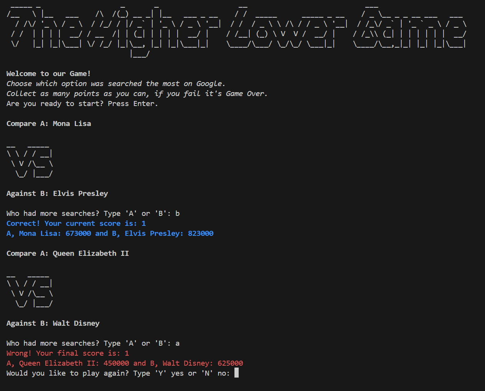

##  Higher or Lower Game

A frustratingly addictive game of higher or lower using Google searches.
The data is based on global monthly searches in 2023.

## Rules

- Keeps asking vs questions until you answer incorrectly, then you loose.
- Guess correctly and acumulate as many points as possible !

## Inspiration
https://www.higherlowergame.com/

# Higher or Lower Game

## Overview

Welcome to the **Higher or Lower Game**, a fun and addictive game where you guess which of two random search terms has more Google searches. 
The game continues until you make an incorrect guess. Try to accumulate as many points as you can!

## Game Description

In this game, you will be presented with two random search terms. Your task is to determine which term has a higher number of Google searches based on the data provided. Each correct guess will earn you one point, and an incorrect guess will end the game. After the game ends, you have the option to play again.

## Example Terminal Output

Here’s an example of what the game looks like in the terminal:



## Features

- **Interactive Gameplay:** Simple interface with clear prompts.
- **Points System:** Earn points for each correct guess.
- **Replay Option:** Play again after game over to beat your high score.
- **ASCII Art:** The game uses ASCII art for visual enhancements, including logos and graphical elements.
- **ANSI Escape Codes:** ANSI escape codes are utilized to provide colored and styled text output in the terminal.

## How to Play

1. **Start the Game:** Run the game by executing the `play_Higher_Lower.bat` file.
2. **Guess:** You will be shown two search terms. Enter 'A' if you think the first term has more searches, or 'B' if you think the second term does.
3. **Score:** Your score increases for each correct guess. The game will show the number of searches for both terms after each round.
4. **Game Over:** If you guess incorrectly, the game will end and show your final score. You will then be asked if you want to play again.

## Installation

1. **Clone or Download the Repository:**

   Clone the repository using Git:
   ```bash
   git clone <repository_url>
